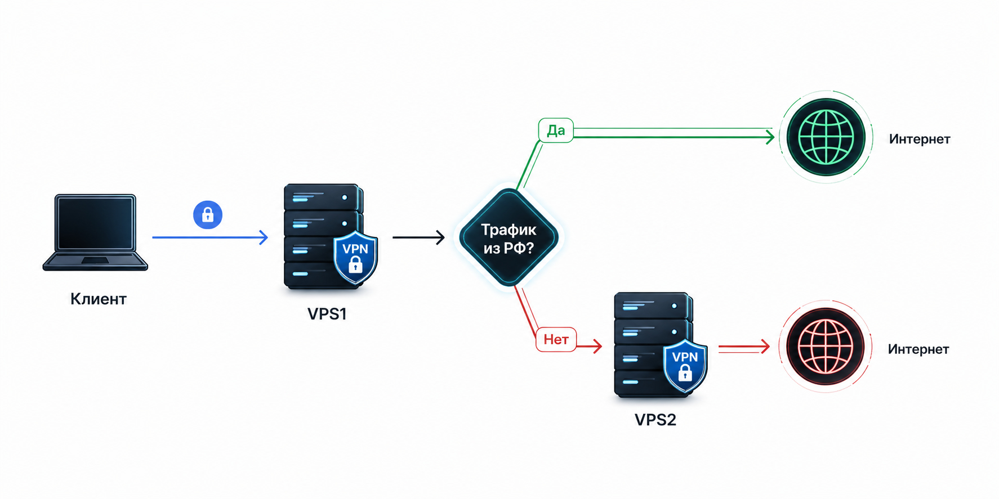

# chain-proxy — личный VPN split-tunneling на двух серверах

[](https://github.com/AlexandrKoliukh/chain-proxy/actions/workflows/tests.yml)


[Часто задаваемые вопросы](docs/FAQ.md)
> Правила роутинга взял у [hydraponique/roscomvpn-routing](https://github.com/hydraponique/roscomvpn-routing)

Этот репозиторий автоматически настраивает **два арендованных сервера** так, чтобы у вас был свой личный VPN-канал с важным свойством:

- Русскоязычные сайты (Яндекс, VK, Mail, Сбер и т. п.) **открываются с IP домашнего сервера** — не банят вас за «вход из-за границы».
- Всё остальное (Google, YouTube, иностранные сервисы) **выходит в интернет через зарубежный сервер** — работает без блокировок.

Вы **один раз** арендуете два сервера, запускаете одну команду на VPS1 и заполняете форму в браузере. Ни Ansible, ни `.env`, ни терминальные команды на вашем компьютере — только браузер.

---

## Что вам понадобится

### 1. Два сервера (VPS)

Купите у любого провайдера, рекомендую https://aeza.ru/?ref=468442

| Сервер | Где | Зачем | Минимум                                     |
|--------|-----|-------|---------------------------------------------|
| **VPS1** | **Домашний** (внутри РФ) | «Входной» — к нему подключается ваш телефон/ноутбук. На нём же живёт веб-панель управления. | 1 CPU, 2 GB RAM, Ubuntu 24.04 |
| **VPS2** | **Зарубежный** (любая страна вне РФ) | «Выходной» — через него вы выходите в интернет | 1 CPU, 1 GB RAM, Ubuntu 24.04 |

**Важно** при заказе:
- Операционная система: **Ubuntu 24.04**.
- Вам должны прислать **IP-адреса** и **root-пароль** к обоим серверам.

### 2. Клиент (приложение на телефоне/ноутбуке)

Выберите одно — установите **заранее**, в конце настройки вставите туда готовую ссылку:

- **[Amnezia](https://amnezia.org)** — самое простое, на русском, для всех ОС.
- **[v2rayN](https://github.com/2dust/v2rayN)** — Windows.
- **[NekoBox](https://github.com/MatsuriDayo/NekoBoxForAndroid)** — Android.
- **[V2Box](https://apps.apple.com/app/v2box-v2ray-client/id6446814690)** — iOS.

---

## Установка (пошагово)

### Шаг 1. Подключитесь к VPS1 по SSH

```bash
ssh root@IP_ВАШЕГО_VPS1
```

Если у вас только пароль (без ключа) — просто введите его при подключении. Дальнейшие действия выполняются прямо внутри этого SSH-сеанса.

#### Либо воспользуйтесь терминалом на сайте провайдера

1. Зайдите на страницу своего vps на сайте провайдера.
2. Найдите консоль/терминал/VNC
3. Выполняйте команды от туда

### Шаг 2. Запустите установочный скрипт

```bash
curl -fsSL https://raw.githubusercontent.com/AlexandrKoliukh/chain-proxy/main/bootstrap.sh | bash
```

Скрипт сделает всё сам (~2–5 минут):

1. Установит Docker, Ansible и нужные утилиты.
2. Скачает этот репозиторий в `/opt/chain-proxy`.
3. Соберёт Docker-образ и запустит веб-панель.

В конце скрипт напечатает **адрес веб-панели и временный пароль**:

```
═══════════════════════════════════════════════════════════════
✓ chain-proxy UI поднят.

  URL:   https://99.111.10.11:8443
  Login: admin
  Pass:  Abc123XyzQwerty78

  Браузер пожалуется на self-signed cert — это ожидаемо, примите.
═══════════════════════════════════════════════════════════════
```

### Шаг 3. Откройте веб-панель в браузере

Перейдите по адресу `https://IP_VPS1:8443`.

Браузер покажет предупреждение «небезопасное соединение» — это потому что сертификат самоподписанный. Нажмите «Дополнительно» → «Продолжить» (в Chrome) или аналогичную кнопку. Введите логин `admin` и временный пароль из терминала.

### Шаг 4. Заполните настройки

На странице **Настройки** укажите:

| Поле | Что вписать |
|------|-------------|
| IP VPS1 | IP домашнего сервера (VPS1) — тот, на котором вы уже находитесь |
| IP VPS2 | IP зарубежного сервера (VPS2) |
| VPS2 user | `root` (по умолчанию — подходит для большинства хостеров) |
| VPS2 password | Root-пароль от VPS2 — панель использует его для SSH-подключения |
| VPS2 port | `22` (по умолчанию) |
| Reality dest_host | Оставьте `www.microsoft.com` — менять не нужно |

Нажмите **Сохранить**.

### Шаг 5. Сгенерируйте секретные ключи

На той же странице нажмите кнопку **Сгенерировать ключи**.

Панель запустит `gen-keys.sh` — он создаёт UUID, пары ключей шифрования (x25519 для Reality) и ключи WireGuard. Готово — ключи сохранены в `data/config.yml` на сервере. Трогать ничего вручную не нужно.

> Повторное нажатие «Сгенерировать ключи» перезапишет все ключи — старые VLESS-ссылки перестанут работать. Нажимайте только если хотите полный сброс.

### Шаг 6. Запустите Deploy

Перейдите на страницу **Deploy**.

- В выпадающем списке выберите **«Обе (VPS1 + VPS2)»**.
- Нажмите **Запустить deploy**.

В окне ниже появится живой вывод Ansible. Процесс занимает 3–7 минут: обновление пакетов, установка Xray, настройка WireGuard, правила файрвола. В конце вы увидите `[exit 0]` — всё прошло успешно.

### Шаг 7. Получите ссылку для клиента

Перейдите на страницу **Клиент**.

Вы увидите QR-код и VLESS-ссылку для `admin` и `friends`. Отсканируйте QR или скопируйте ссылку в ваше приложение:

- **Amnezia:** «+» → «Импорт из строки подключения» → вставьте `vless://...`.
- **v2rayN:** «Servers» → «Import from clipboard» (предварительно скопировав ссылку).
- **NekoBox / V2Box:** «+» → «Импортировать из буфера обмена».

Включите подключение. Всё.

### Шаг 8. (Опционально) Смените пароль от панели

Временный пароль лежит в файле `/opt/chain-proxy/data/initial-password.txt` на сервере — он служит только для первого входа. Зайдите в **Настройки** → «Сменить пароль UI» и установите постоянный пароль. Файл с временным паролем удалится автоматически.

---

## Как проверить, что всё работает

С устройства, где **включен** клиент, в браузере откройте:

| Адрес | Что должно произойти                   |
|-------|----------------------------------------|
| https://api.ipify.org | Показать IP зарубежного сервера (VPS2) |
| https://2ip.ru/ | Показать IP домашнего сервера (VPS1)   |
| https://yandex.ru | Открыться нормально, как из России     |

Состояние туннелей в реальном времени — на странице **Статус** в веб-панели.

**Главное доказательство работы схемы:** российские сайты видят вас с IP домашнего сервера, а Google и прочее — с IP зарубежного. Никто не в курсе, что трафик разделяется.

---

## Веб-панель (обзор разделов)

| Раздел | Что делает |
|--------|-----------|
| **Настройки** | IP серверов, пароль VPS2, Reality SNI; кнопки «Сохранить» и «Сгенерировать ключи»; смена пароля панели |
| **Deploy** | Запуск `ansible-playbook` с прямым выводом логов в браузере; три цели: оба / только VPS1 / только VPS2 |
| **Статус** | Состояние Xray и WireGuard на обоих серверах; возраст WG-handshake; наличие fwmark-маршрута |
| **Клиент** | Готовые VLESS-ссылки и QR-коды для всех пользователей |

---

## Если что-то пошло не так

| Симптом | Что проверить |
|---------|---------------|
| Bootstrap завершился с ошибкой | Убедитесь, что вы на Debian/Ubuntu и запущены как `root`. Проверьте доступ в интернет: `curl -s https://api.ipify.org`. |
| Панель не открывается (`https://IP:8443`) | Проверьте контейнер: `docker ps` — должен быть `chain-proxy-ui`. Если нет: `docker compose -f /opt/chain-proxy/docker-compose.yml up -d`. |
| Браузер говорит «соединение отклонено» | Порт 8443 не пробит в файрволе хостера. Откройте его в личном кабинете хостера (отдельно от UFW — некоторые хостеры держат свой файрвол вне VPS). |
| Deploy падает на «Validate required variables» | Нажмите «Сгенерировать ключи» перед Deploy — все UUID и ключи должны быть заполнены. |
| Deploy падает: «Permission denied» / «Authentication failed» для VPS2 | Неверный пароль VPS2. Попробуйте вручную: `ssh root@IP_VPS2`. Убедитесь, что `PasswordAuthentication yes` включён в `/etc/ssh/sshd_config` на VPS2. |
| Клиент подключается, но сайты не открываются | Страница **Статус** — Xray должен быть `active`, handshake — не `never` и свежий (< 3 мин). |
| Google открывается, а Яндекс не открывается (или наоборот) | Попробуйте **Deploy → только VPS1** — Ansible обновит конфиг и geodata. |
| Клиент вообще не коннектится | «Сгенерировать ключи» → «Deploy оба» → зайдите на **Клиент** и возьмите новую ссылку. |

Логи контейнера с панелью и Ansible:

```bash
# на VPS1:
docker compose -f /opt/chain-proxy/docker-compose.yml logs -f ui
```

Логи Xray:

```bash
# на VPS1:
journalctl -u xray -f
```

---

## Объяснение переменных простыми словами

### `data/config.yml` (создаётся веб-панелью)

Это единственный файл с вашими настройками — аналог `.env` в старой схеме. Лежит в `/opt/chain-proxy/data/config.yml`. Редактировать руками не нужно: всё вписывается через форму в панели.

| Поле | Что это |
|------|---------|
| `hosts.vps1_ip` | IP домашнего сервера. |
| `hosts.vps2_ip` | IP зарубежного сервера. |
| `hosts.vps2_password` | Root-пароль VPS2 (используется `sshpass`). |
| `reality.dest_host` | Сайт, под который VPN «притворяется» на уровне TLS. По умолчанию `www.microsoft.com`. |
| `keys.*` | UUID, x25519 и WireGuard ключи. Генерируются кнопкой в панели. |

### `ansible/group_vars/all.yml` — общие настройки

| Переменная | Что это | Когда трогать |
|------------|---------|---------------|
| `reality_dest_host` | «Маскировочный» сайт. | Обычно не трогать. Если Microsoft заблокируют — поменять на `www.apple.com` или `www.cloudflare.com`. Это поле также доступно в панели. |
| `geodata_update_enabled` | Автообновление списков IP-адресов. | Оставить `true`. |
| `firewall_allowed_tcp_ports` | Какие порты открыты наружу. | Оставить как есть. |

---

## Команды Makefile (для тех, кто хочет работать из терминала)

Все команды — на VPS1 в директории `/opt/chain-proxy`. Старый CLI-флоу полностью сохранён.

### Веб-панель

| Команда | Что делает |
|---------|-----------|
| `make ui-up` | Поднять / перезапустить UI-контейнер. |
| `make ui-stop` | Остановить UI-контейнер. |
| `make ui-logs` | Хвост логов UI-контейнера в реальном времени. |
| `make ui-rebuild` | Пересобрать Docker-образ и перезапустить. |
| `make ui-shell` | Зайти в контейнер (диагностика). |

### Деплой из терминала (опционально)

Если хотите деплоить вручную, а не через панель — настройте `.env` из примера и запускайте так же, как раньше.

| Команда | Что делает |
|---------|-----------|
| `make gen-keys` | Генерирует ключи и UUID (пишет в `.env`). |
| `make deploy` | Настраивает **оба** сервера с нуля или накатывает изменения. |
| `make deploy-entry` | Только VPS1 (домашний). |
| `make deploy-exit` | Только VPS2 (зарубежный). |

### Повседневная работа

| Команда | Что делает |
|---------|-----------|
| `make status` | Состояние Xray (VPS1) + WireGuard (оба). |
| `make logs` | Последние строки логов: Xray (VPS1) + wg-quick (оба). |
| `make restart` | Перезапустить Xray + WireGuard. |
| `make xray-test` | Проверить, что конфиг Xray валидный. |
| `make wg-show` | WireGuard-статус: peer + время последнего handshake. |
| `make wg-restart` | Перезапустить только WireGuard. |
| `make ping` | Проверить SSH-доступность серверов. |

Подсказка: `make help` — полный список.

---

## Архитектура (для любопытных)

```
  Ваш телефон/ноутбук (клиент)
       │    зашифровано по протоколу VLESS + Reality (TCP/443)
       ▼
  ┌──────────────────────────────┐   Если сайт российский → выход прямо с VPS1 (домашний IP)
  │ VPS1 (домашний)              │   Если локальная сеть  → заблокировано
  │  Xray + WireGuard            │─▶ Всё остальное        → уходит в WireGuard-туннель
  │  [chain-proxy-ui :8443]      │
  └────────┬─────────────────────┘
           │ WireGuard (UDP/51820), шифрование в ядре
           ▼
  ┌──────────────────────┐
  │ VPS2 (зарубежный)    │─▶ выход в интернет (зарубежный IP)
  │ только WireGuard+NAT │
  └──────────────────────┘
```

Веб-панель живёт в Docker-контейнере на VPS1. Когда вы нажимаете Deploy, контейнер вызывает `ansible-playbook` через `nsenter` — это позволяет Ansible работать напрямую с хостом (ставить пакеты, управлять systemd, настраивать сеть), как если бы он запускался без Docker.

**Почему двух серверов достаточно:**
- Один домашний нужен, чтобы Яндекс/Mail/Госуслуги видели «нормального пользователя из России».
- Один зарубежный нужен, чтобы Google/YouTube/etc работали без ограничений.
- Правило «кто куда» написано на VPS1 и обновляется автоматически (geodata раз в неделю).

**Почему именно так — а не два Reality-хопа:** маскировка нужна только на том участке, где трафик идёт через российских провайдеров (клиент↔VPS1). Между двумя нашими серверами цензора нет — там нужна только скорость. WireGuard в ядре быстрее: одно шифрование вместо двух, UDP вместо двойного TCP, и Xray на VPS2 вообще не нужен.

**Что такое VLESS + Reality:** современный протокол, при котором ваш VPN снаружи выглядит как обычный поход на `www.microsoft.com`. Провайдер / DPI не может отличить и не блокирует.

---

## Управление пользователями (admin / friends / ещё)

«Из коробки» уже есть **два логина**: `admin` (для вас) и `friends` (общая ссылка для друзей). У каждого свой UUID, но Reality-ключи (`pbk`, `sid`) общие. Это значит:

- ссылку `friends` можно безопасно раздавать — она не выдаёт ваш `admin`-UUID;
- если нужно «отключить» друзей — меняется только их UUID, ваш `admin` остаётся прежним.

### Где это лежит

Список клиентов описан в [`ansible/group_vars/entry.yml`](ansible/group_vars/entry.yml):

```yaml
entry_clients:
  - email: "admin"
    id: "{{ lookup('env', 'ENTRY_CLIENT_UUID') }}"
  - email: "friends"
    id: "{{ lookup('env', 'ENTRY_FRIENDS_UUID') }}"
```

### Сменить UUID для друзей (если ссылка «утекла»)

На VPS1:

```bash
cd /opt/chain-proxy
NEW_UUID=$(uuidgen | tr '[:upper:]' '[:lower:]')
# Обновить поле в data/config.yml (или через панель → Настройки → Сгенерировать ключи с заменой только friends)
python3 -c "
import yaml
cfg = yaml.safe_load(open('data/config.yml'))
cfg['keys']['entry_friends_uuid'] = '$NEW_UUID'
open('data/config.yml','w').write(yaml.safe_dump(cfg))
print('done')
"
make deploy-entry
```

Старая ссылка для друзей перестанет работать сразу. Ваша `admin`-ссылка не затрагивается.

> Кнопка «Сгенерировать ключи» в панели перегенерирует **весь** блок ключей (и admin, и friends, и Reality-ключи, и WG). После этого старые ссылки умрут у обоих — используйте только когда хотите полный сброс.

### Добавить третьего пользователя (например, для работы)

1. Допишите запись в [`ansible/group_vars/entry.yml`](ansible/group_vars/entry.yml):

   ```yaml
   entry_clients:
     - email: "admin"
       id: "{{ lookup('env', 'ENTRY_CLIENT_UUID') }}"
     - email: "friends"
       id: "{{ lookup('env', 'ENTRY_FRIENDS_UUID') }}"
     - email: "work"
       id: "{{ lookup('env', 'ENTRY_WORK_UUID') }}"
   ```

2. На VPS1 добавьте UUID в `data/config.yml` вручную (в раздел `keys: entry_work_uuid: <uuid>`) или через панель после расширения шаблона entry.yml.

3. Запустите Deploy. Новая ссылка появится на странице **Клиент**.

> Никаких новых Reality-ключей генерировать не нужно — все клиенты делят один серверный keypair и один shortId.

---

## Структура проекта

```
chain-proxy/
├── bootstrap.sh            # ← curl | bash — устанавливает всё на VPS1
├── Dockerfile              #   образ веб-панели (python:3.12-slim + зависимости)
├── docker-compose.yml      #   запуск контейнера (host network, pid host, privileged)
├── Makefile                #   make ui-up / deploy / status / wg-show / ...
├── .env.example            #   шаблон для CLI-флоу с лаптопа
├── README.md               #   этот файл
├── ui/                     #   веб-панель (FastAPI + htmx)
│   ├── main.py             #     роуты (settings, deploy, status, client)
│   ├── config.py           #     чтение/запись data/config.yml
│   ├── auth.py             #     basic-auth, bcrypt
│   ├── tls.py              #     self-signed cert
│   ├── runner.py           #     обёртка над nsenter + subprocess
│   ├── deploy.py           #     запуск ansible + SSE-стрим логов
│   ├── keys.py             #     обёртка над gen-keys.sh
│   ├── status.py           #     wg show + systemctl
│   ├── vless.py            #     сборка VLESS-ссылок + QR
│   ├── templates/          #     HTML (base, settings, deploy, status, client)
│   └── static/style.css    #     минимальный тёмный CSS
└── ansible/
    ├── ansible.cfg
    ├── inventory.yml       # читает переменные из окружения (не трогать)
    ├── group_vars/
    │   ├── all.yml         # общие настройки (SNI, cron, файрвол, WG-параметры)
    │   ├── entry.yml       # читает ENTRY_*/WG_* из окружения (не трогать)
    │   └── exit.yml        # читает WG_VPS2_*/WG_VPS1_PUBLIC из окружения (не трогать)
    ├── playbooks/site.yml
    ├── roles/
    │   ├── common/         # обновления, файрвол, время, BBR + sysctl tuning
    │   ├── wireguard/      # WG-туннель VPS1↔VPS2 (на оба сервера)
    │   ├── xray/           # установка Xray + geodata + автообновление (только VPS1)
    │   ├── xray_entry/     # конфиг VPS1 (вход Reality + маршрутизация)
    │   └── xray_exit/      # legacy, не используется (для git revert)
    └── scripts/
        ├── gen-keys.sh     # генерация UUID/x25519/WG ключей
        └── with-ssh-key.sh # CLI-флоу: загрузка SSH-ключа в агент
```
